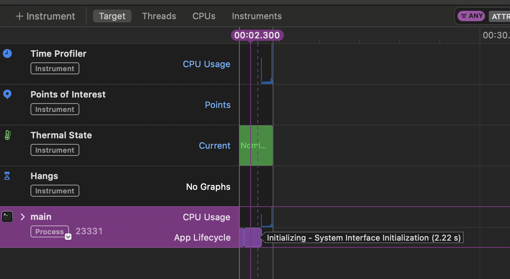
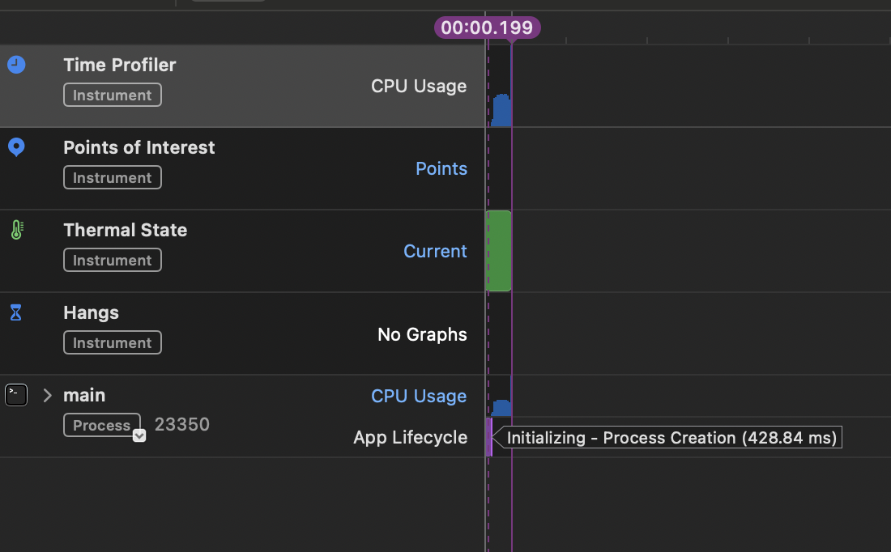
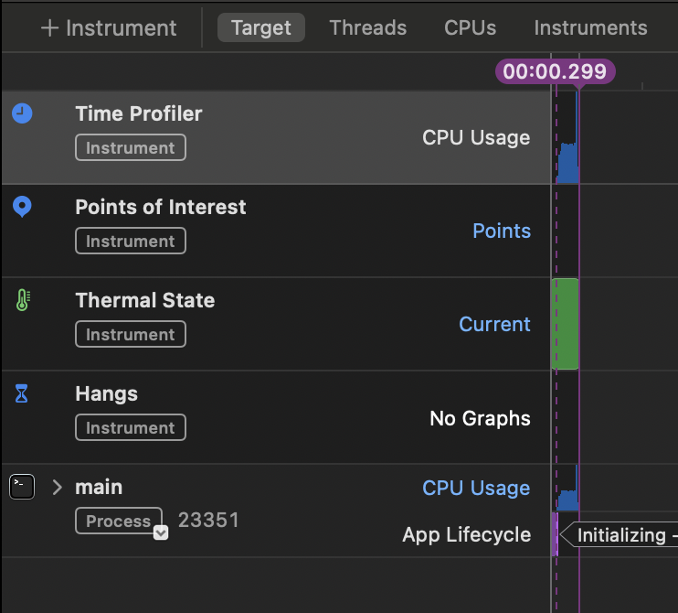
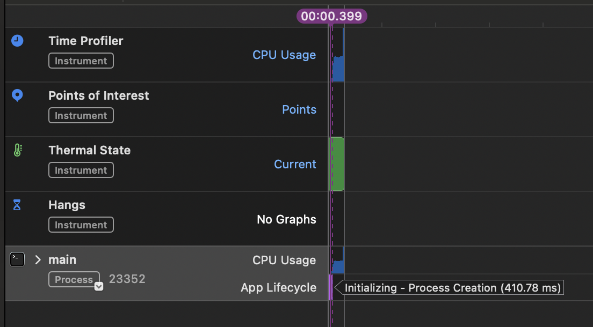
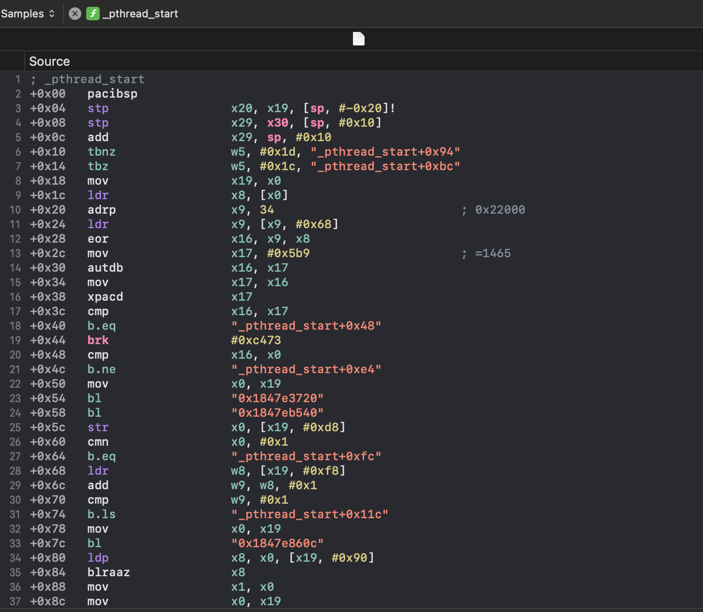

# Memory Stress Test

This project demonstrates a multi-threaded memory stress test program in C++ designed to saturate the memory bus and measure throughput (MB/s). It can run in either sequential or random access modes, allowing you to observe differences in performance and potential bottlenecks related to the von Neumann architecture (where data and instruction share the same bus).

## Table of Contents

1. [Overview](#overview)  
2. [Requirements](#requirements)  
3. [Build & Run](#build--run)  
4. [Configuration](#configuration)  
5. [Experimenting Further](#experimenting-further)  
6. [What the Test Does](#what-the-test-does)  
7. [Profiling & Analysis](#profiling--analysis)

---

## Overview

- **Multi-threaded**: Spawns multiple threads to read from and write to a shared large buffer, which puts pressure on the memory subsystem.  
- **Sequential vs. Random Access**: You can toggle between two memory-access patterns via a command-line argument (`--random` or `-r`).  
- **Measurement**: Reports total bytes processed, elapsed time, and throughput (in MB/s).  
- **Demonstrates**: The limitations of the shared memory bus (the von Neumann bottleneck).

---

## Requirements

- A modern C++ compiler supporting at least **C++17** (e.g., `g++`, `clang++`, MSVC).  
- A machine with enough memory to handle the chosen buffer size (default is 512 MB).

---

## Build & Run

### Option A — CMake (recommended)

```bash
# Configure & build (Release)
cmake -S . -B build -DCMAKE_BUILD_TYPE=Release
cmake --build build --parallel

# Run
./build/my_program           # sequential
./build/my_program --random  # random
````

### Option B — Single-file compile

```bash
# GCC/Clang
g++ -std=c++17 -O3 -pthread main.cpp -o main

# Run
./main           # sequential
./main --random  # random
```

### Example Output

```text
Memory Stress Test
------------------
Buffer size    : 536870912 bytes
Iterations     : 10
Threads        : 8
Access pattern : Sequential

Total bytes processed : 10737418240.00 bytes
Elapsed time          : 1.25 s
Throughput            : 8179.87 MB/s
```

---

## Configuration

You can modify these constants in `main.cpp` to change behavior:

* **`NUM_THREADS`**: Number of threads (default: 8)
* **`BUFFER_SIZE`**: Size of the large buffer (default: 512 MB). You can switch to 1 GB or 2 GB by adjusting:

  ```cpp
  static const size_t BUFFER_SIZE = 1024ull * 1024ull * 1024ull; // 1 GB
  ```
* **`ITERATIONS`**: Number of times each thread repeats the read/write pattern.

---

## Experimenting Further

1. **Change `NUM_THREADS`**
   Observe how throughput scales with more threads. After a point, increasing threads causes memory bandwidth saturation.

2. **Adjust `BUFFER_SIZE`**
   Try values above your CPU’s last-level cache (LLC) size to see the effect on cache miss rates.

3. **Random vs. Sequential Access**

   ```bash
   ./my_program         # Sequential
   ./my_program -r      # Random
   ```

   Random accesses reduce prefetching efficiency and increase cache misses.

4. **Run on Different Hardware**
   Try this test on different CPUs to study memory architecture and bandwidth limitations.

---

## What the Test Does

1. **Initial Setup**
   Allocates a shared memory buffer and launches multiple threads.

2. **Thread Workload**
   Each thread performs repeated read/write operations on its chunk, either sequentially or randomly.

3. **Throughput Measurement**
   All threads' workloads are timed and summed. Final output shows total bytes processed and throughput in MB/s.

---

## Profiling & Analysis

The program was profiled on **macOS (Apple Silicon)** using **Xcode Instruments** to understand CPU usage and runtime behavior.

### 🔥 Runtime Breakdown

#### Run 1: Cold Start

* Duration: \~4 seconds
* Notable delay from **system interface initialization** (\~2.22 s): OS-level startup costs (loading dynamic libraries, sandbox setup, service prep). This overhead is external to your code.



#### Runs 2–4: Warm Starts

* Duration: \~0.4 seconds
* Initialization mostly includes process creation and minimal CPU wait time.
* Actual workload starts quickly; memory paths are effectively “warmed up.”





### 🧠 Analysis Summary

* **First-run overhead is external**: OS startup and system framework loading dominate time.
* **Subsequent runs reflect real workload**: With cold start costs eliminated, you see consistent performance across warm runs.
* **Performance difference source**:

  * Not your program logic.
  * Primarily due to OS environment caching and shared library loading.

### ⏱️ CPU Function Trace

The CPU usage breakdown in Instruments shows that the C++ logic consumes time across multiple short functions (often displayed in assembly if built without debug symbols). No single bottleneck dominates.


